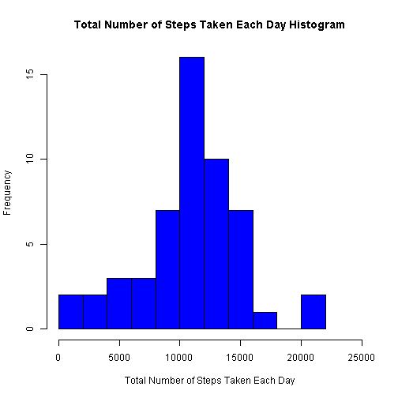
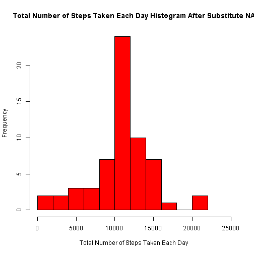
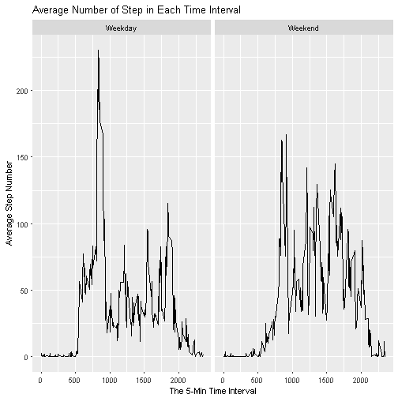

Reproducible Research Project 1 by RapheephanL
===========================================================

##This is a markdown file of activity monitoring device project.


Data set: Activity monitoring data in CSV file

Variable: steps in 5-min interval, date (YYYY-MM-DD), time interval

#Loading and preprocessing the data

Download dataset from csv file and set up date as Date format.


```r
rawdata<-read.csv("activity.csv")
rawdata$date<-as.Date(rawdata$date,format="%Y-%m-%d")
```
#What is mean total number of steps taken per day?
Calculate the total number of steps taken each day and plot histogram.


```r
totalstep_raw<-tapply(rawdata$steps,rawdata$date,sum)
hist(totalstep_raw,breaks=10,col="blue",main="Total Number of Steps Taken Each Day Histogram",xlim=c(0,25000),xlab="Total Number of Steps Taken Each Day")
```



The mean and median are summarized below.


```r
summary(totalstep_raw)
```

```
##    Min. 1st Qu.  Median    Mean 3rd Qu.    Max.    NA's 
##      41    8841   10765   10766   13294   21194       8
```
#What is the average daily activity pattern?
Next, let's calculate the average number of steps taken in each 5-min interval. The plot will be illustrated in line format.


```r
averagestep_time_raw<-tapply(rawdata$steps,rawdata$interval,mean,na.rm=TRUE)
plot(row.names(averagestep_time_raw),averagestep_time_raw,type="l",main="Average Steps in Each 5-Min Interval",xlab="The 5-Min Time Interval",ylab="Average Steps",col="green",lwd="3")
```


The 5-min time interval that contains maximum steps is

```r
which.max(averagestep_time_raw)
```

```
## 835 
## 104
```
The maximum steps are 

```r
max(averagestep_time_raw)
```

```
## [1] 206.1698
```
#Imputing missing values
From the study above, we found plenty of missing values as shown in NA. In this part, we will handle the missing value data by assigning the average of steps in that 5-min time interval.

First, let's summary the number and fraction of NA data.


```r
sum(is.na(rawdata$steps))
```

```
## [1] 2304
```

```r
mean(is.na(rawdata$steps))
```

```
## [1] 0.1311475
```
Second, replace NA value with the average of steps in that 5-min time interval.

```r
processdata<-rawdata

for (i in 1:17568) {

  if (is.na(processdata[i,1])) {
  interval<-as.character(processdata[i,3])  
  processdata[i,1]<-averagestep_time_raw[rownames=interval]  
  }
}
```

Third, recalculate total step per day with the new data that NA was substituted.

```r
totalstep_process<-tapply(processdata$steps,processdata$date,sum)
hist(totalstep_process,breaks=10,col="red",main="Total Number of Steps Taken Each Day Histogram After Substitute NA",xlim=c(0,25000),xlab="Total Number of Steps Taken Each Day")
```



Last, calculate mean and median of the new data after processing data.


```r
summary(totalstep_process)
```

```
##    Min. 1st Qu.  Median    Mean 3rd Qu.    Max. 
##      41    9819   10766   10766   12811   21194
```

```r
summary(totalstep_raw)
```

```
##    Min. 1st Qu.  Median    Mean 3rd Qu.    Max.    NA's 
##      41    8841   10765   10766   13294   21194       8
```
It shows that the mean and median of raw and process data are very similar. Therefore, NA substitution has little effect on the calculated total steps per day.

#Are there differences in activity patterns between weekdays and weekends?

Next, we will investigate the data based on weekday and weekend by using function "weekdays()".


```r
processdata$day<-weekdays(processdata$date)
for (i in 1:17568) {

  if (processdata[i,4]=="Saturday"|processdata[i,4]=="Sunday") {
  processdata[i,5]<-"Weekend"}
  else 
  processdata[i,5]<-"Weekday"
  
}
```
Calculate the average of step for each time interval for weekday and weekend.

```r
averagestep_daytype<-aggregate(processdata[,1],by=list(processdata[,3],processdata[,5]),FUN=mean)
colnames(averagestep_daytype)<-c("interval","daytype","steps")
```
Plot the average of step for each time interval for weekday and weekend.

```r
library(ggplot2)
qplot(interval,steps,data=averagestep_daytype,geom=c("line"),facets=.~daytype,main="Average Number of Step in Each Time Interval",xlab="The 5-Min Time Interval",ylab="Average Step Number")
```



The conclusion from panel plots can be summarized as follows:

1.The activities during weekend is more spread out than weekday.

2.During interval 750-1000, the activities during weekday is denser than weekend.
